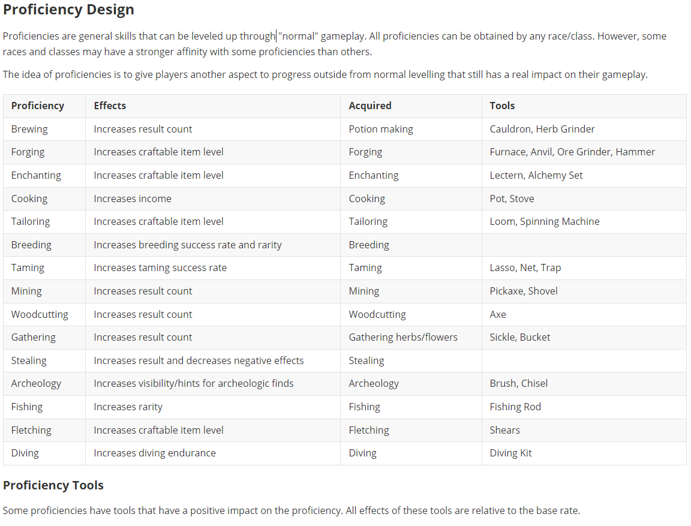

# The beginning of a long road - game documentation

We started the creation of our game documentation which might count as the first official step in our game development journey. Naturally it is starting out very unstructured and with a lot of ideas that are bound to change. Nevertheless, it helps to get some of the concept on "paper" for future reference and to make it easier to keep track of all of them.

The document will contain the following key aspects:

* Story
* Game systems
* Technical components

We plan to eventually release this document, probably as a goodie for a collectors edition. Of course, we will redact some content to avoid spoiling some parts of the story and game content.

2024-07-01